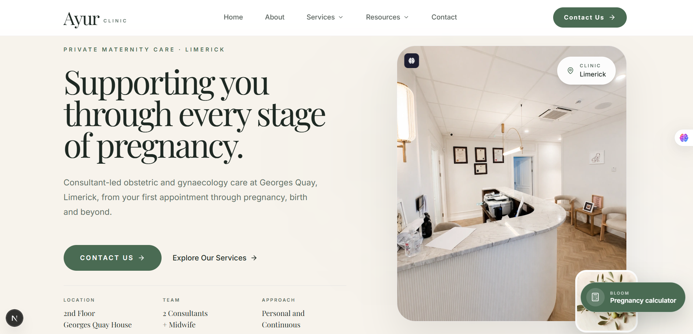
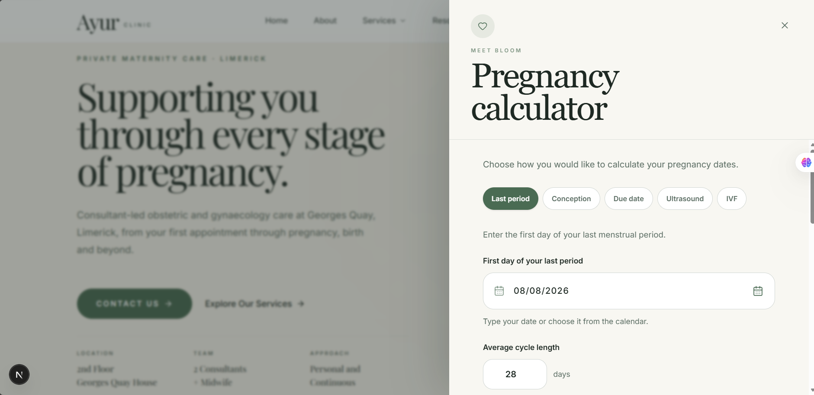
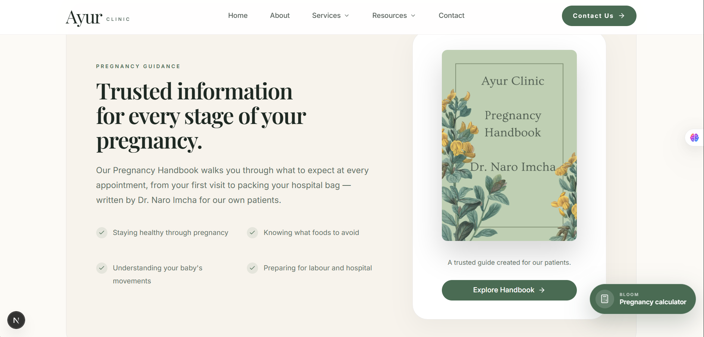
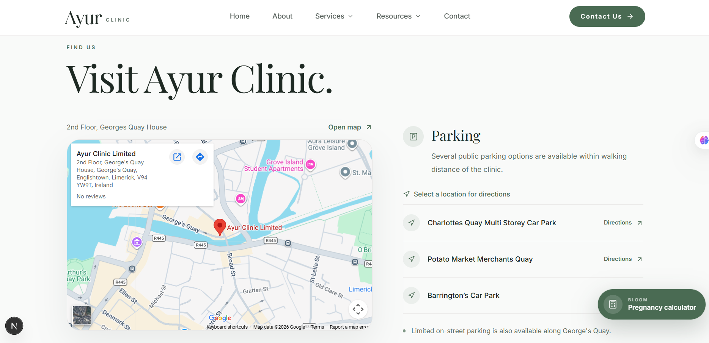

# Ayur Clinic — Healthcare Website Case Study

> A case study documenting the design and development of a privacy-focused digital platform for Ayur Clinic, a private Obstetrics & Gynaecology consultancy in Limerick, Ireland.

## Project Status

**Under Active Development**

This repository documents the ongoing design and development of the Ayur Clinic digital platform.

The project is currently in active development and has not yet reached its final production release. The screenshots, architecture, features, and implementation details documented here represent the current state and direction of the project and may evolve as development continues.

---

## Overview

Ayur Clinic is a private Obstetrics & Gynaecology consultancy based in Limerick, Ireland.

The goal of this project is to create a modern, professional, accessible, and scalable digital presence that helps patients clearly understand the clinic, its services, resources, and practical information.

The project was approached as more than a visual website redesign.

The objective is to establish a strong product, design, and technical foundation that supports the clinic's current needs while allowing the platform to evolve responsibly in the future.

The initial focus is on creating an informative and patient-friendly digital experience without introducing unnecessary complexity or collecting unnecessary sensitive information.

---

# The Challenge

Healthcare websites require a different approach from typical marketing websites.

Patients need to be able to quickly understand:

- Who the clinic is
- What services are available
- Who the consultants and care team are
- Where the clinic is located
- How to prepare for appointments
- Where to find reliable pregnancy and maternity resources

At the same time, the platform needs to consider accessibility, privacy, trust, maintainability, and future scalability.

The project therefore needed to balance:

- A professional and reassuring patient experience
- Clear presentation of specialist services
- Accessible and inclusive design
- Strong visual hierarchy
- Privacy-conscious data handling
- Avoidance of unnecessary collection of sensitive health information
- A scalable technical architecture
- A maintainable component system for future development

A key architectural decision was to keep the initial informational platform separate from more complex future functionality such as appointment workflows, administrative systems, or other patient interactions.

This allows the first release to remain focused, understandable, and easier to maintain.

---

# The Solution

The solution is a modern healthcare-focused web platform built around clear information architecture, deliberate visual hierarchy, reusable components, and privacy-conscious product decisions.

The design focuses on creating an experience that feels:

- Professional
- Calm
- Reassuring
- Modern
- Accessible
- Easy to navigate

The platform uses strong typography, generous whitespace, restrained visual elements, and a consistent healthcare-focused colour system to create a premium and approachable patient experience.

The product structure prioritises clear access to:

- Clinic information
- Consultant and team details
- Specialist services
- Pregnancy and maternity resources
- Interactive patient tools
- Clinic location and parking information
- Contact and practical information

---

# Design Approach

The visual direction was designed specifically for a private healthcare environment.

Rather than using an overly clinical or generic corporate design, the interface aims to feel warm, considered, and professional.

Key design principles include:

- Clear typography hierarchy
- Deliberate use of whitespace
- Calm and restrained colour usage
- Strong contrast for readability
- Consistent spacing and layout patterns
- Reusable card and content patterns
- Clear calls to action
- Responsive layouts
- Accessible interaction patterns

The objective is not simply to make the website visually attractive, but to create a clearer and more reassuring experience for patients navigating important healthcare information.

---

# Current Implementation

The project is currently under active development.

The screenshots below show selected areas of the current implementation. They represent the current design direction, user experience, and component system being developed.

Features, layouts, and implementation details may change before the initial production release.

## Homepage



The homepage establishes the overall visual direction of the platform.

It introduces the clinic, provides clear navigation, highlights important patient information, and directs visitors toward services and resources.

The design combines a strong editorial-style visual hierarchy with practical healthcare information and accessible calls to action.

Key areas currently represented include:

- Primary navigation
- Clinic introduction
- Service discovery
- Patient resources
- About the clinic
- Pregnancy-related tools
- Clear contact pathways

---

## Pregnancy Calculator



The pregnancy calculator is being developed as an interactive patient resource.

The interface provides multiple calculation methods within a focused and easy-to-use experience.

The current design includes options for calculating pregnancy dates based on:

- Last period
- Conception
- Due date
- Ultrasound
- IVF

The tool is designed to be visually consistent with the rest of the platform while keeping the interaction simple and understandable.

---

## Pregnancy Resources



The pregnancy resources area provides patients with access to structured guidance and educational material.

The current design includes resources intended to support patients throughout different stages of pregnancy.

The platform aims to make important information easier to discover through a clear content hierarchy rather than overwhelming users with large amounts of unstructured information.

Current resource areas include topics related to:

- Pregnancy health
- Food and nutrition guidance
- Understanding pregnancy changes
- Preparing for labour and hospital
- Additional maternity resources

---

## Clinic Location



The location section provides practical information to help patients plan their visit.

The current implementation includes:

- Clinic location information
- Map access
- Directions
- Parking guidance
- Nearby parking options
- Practical visitor information

The objective is to reduce friction for patients before arriving at the clinic by keeping important logistical information in one clear location.

---

# Technical Architecture

The Ayur Clinic platform is being developed with a modular architecture intended to support the current informational website while providing a maintainable foundation for future development.

The codebase separates concerns between application structure, reusable components, configuration, content, features, shared utilities, providers, and types.

The current project structure follows this general approach:

```text
ayur-clinic-web/
│
├── docs/
├── public/
│
├── src/
│   ├── app/
│   ├── assets/
│   ├── components/
│   ├── config/
│   ├── content/
│   ├── features/
│   ├── lib/
│   ├── providers/
│   └── types/
│
├── .env.local
├── .gitignore
├── AGENTS.md
├── CLAUDE.md
├── eslint.config.mjs
├── next-env.d.ts
├── next.config.ts
├── package.json
├── postcss.config.mjs
├── README.md
└── tsconfig.json
```

---

## Application Layer

The `src/app` directory is responsible for application routing and page-level structure.

This follows the Next.js application architecture and provides a foundation for organising different areas of the platform.

The application structure is intended to support areas such as:

- Homepage
- About
- Services
- Team information
- Patient resources
- Contact
- Legal and privacy pages

The routing structure can continue to evolve as additional sections are developed.

---

## Component Layer

Reusable interface components are organised separately from page-specific implementations.

```text
src/components/
```

The component layer is intended to support consistent interface patterns across the application.

Examples of reusable patterns include:

- Navigation
- Buttons
- Cards
- Content sections
- Form elements
- Layout components
- Interactive UI elements
- Typography patterns

This reduces duplication and helps maintain visual consistency as the project grows.

---

## Configuration Layer

Project-wide configuration is separated into:

```text
src/config/
```

This provides a central location for application-level configuration and shared values.

Examples may include:

- Site information
- Navigation configuration
- Shared application settings
- Metadata configuration

Centralising this information helps reduce duplication and makes future changes easier to manage.

---

## Content Layer

Content is separated from presentation logic where appropriate.

```text
src/content/
```

This structure is intended to support maintainable management of information such as:

- Services
- Team information
- Patient resources
- Educational content

Separating structured content from page presentation helps the application remain easier to maintain as information changes.

---

## Feature Layer

Feature-specific functionality is organised separately from general shared components.

```text
src/features/
```

This approach allows functionality to be grouped around specific product areas rather than placing all application logic into a single large component directory.

As the platform grows, this structure can support independently organised features while maintaining clear boundaries between shared UI and feature-specific behaviour.

---

## Shared Utilities

Shared utilities and application logic are organised within:

```text
src/lib/
```

This area can contain reusable functionality that does not belong directly to a specific page or UI component.

Keeping shared logic separate supports cleaner components and easier maintenance.

---

## Providers

Application-level providers are organised within:

```text
src/providers/
```

This provides a dedicated location for shared application contexts and provider-level functionality where required.

---

## Type Safety

The project uses TypeScript to improve reliability and maintainability.

```text
src/types/
```

Centralised and feature-specific type definitions can help ensure that application data and component interfaces remain explicit as the codebase grows.

Type safety is particularly valuable for a project that is expected to expand over time because it reduces ambiguity and makes refactoring safer.

---

# Technology Stack

The current project is built using a modern frontend stack.

## Next.js

Next.js is used as the primary application framework.

It provides the foundation for:

- Application routing
- Page structure
- Modern React development
- Performance optimisation
- Scalable application organisation

## React

React provides the component-based foundation for the user interface.

The project uses reusable components to create consistent interface patterns across different areas of the platform.

## TypeScript

TypeScript is used to improve type safety and maintainability.

As the application grows, explicit types help reduce potential errors and make the codebase easier to understand and refactor.

## Tailwind CSS

Tailwind CSS is used for styling and implementing the design system.

This allows the interface to be built around reusable spacing, typography, layout, and responsive design patterns while maintaining consistency across the application.

## GitHub

GitHub is used for version control and project documentation.

The separate case study repository documents the product and engineering decisions behind the project while the main application repository contains the active source code.

## Supabase

Supabase is being considered and planned for future backend and database functionality where appropriate.

At the current stage, backend functionality should only be represented as implemented when it has actually been introduced into the production architecture.

---

# Architecture Principles

The project is being developed around several core engineering principles.

## Separation of Concerns

Application routing, components, content, features, configuration, providers, utilities, and types are separated into dedicated areas.

This makes the project easier to navigate and reduces unnecessary coupling between unrelated parts of the application.

---

## Reusability

Shared interface patterns are designed to be reusable rather than duplicated across individual pages.

This helps maintain consistency and makes future changes more efficient.

---

## Scalability

The architecture is designed to support additional pages and features without requiring the entire application to be restructured.

The goal is to allow the platform to grow in a controlled and maintainable way.

---

## Maintainability

The project structure aims to make responsibilities clear.

A developer should be able to understand where to find:

- Application routes
- Shared components
- Feature-specific functionality
- Configuration
- Content
- Utilities
- Providers
- Type definitions

---

## Accessibility

Accessibility is considered throughout the design and implementation process.

The project is being developed with WCAG 2.2 AA as an accessibility target.

Areas of consideration include:

- Readable typography
- Colour contrast
- Keyboard navigation
- Clear focus states
- Semantic HTML
- Accessible interactive controls
- Responsive behaviour
- Clear content hierarchy

Accessibility work remains part of the ongoing development and testing process.

---

# Privacy and Data Strategy

Privacy is an important architectural consideration for healthcare-related platforms.

A key principle of this project is data minimisation.

The initial platform is primarily focused on providing information and resources.

The general website is intentionally designed to avoid collecting unnecessary sensitive medical information through standard website interactions.

Future contact or callback workflows are planned around collecting only the minimum information required for the intended purpose.

This may include:

- Full name
- Email address
- Phone number

The intention is to avoid collecting unnecessary information such as:

- Medical histories
- Symptoms
- Diagnoses
- Treatment details
- Other sensitive health information

through general website forms unless a specific future system has been appropriately designed to handle that information.

---

## Planned Data Protection Approach

Where database-backed functionality is introduced in the future, the architecture is intended to consider:

- Data minimisation
- Appropriate access controls
- Separation between public submissions and administrative access
- Defined retention periods
- Secure handling of personal information
- Automatic deletion of temporary enquiry data where appropriate
- PostgreSQL Row Level Security where applicable
- Appropriate hosting and data location considerations

Supabase is planned as a potential backend and database solution for future functionality.

The exact implementation of these systems will be documented as they are developed rather than represented as completed before implementation.

---

# Development Roadmap

The project is being developed in phases to keep the initial release focused while maintaining a clear path for future expansion.

## Phase 1 — Informational Platform

The current phase focuses on the core digital presence.

Areas include:

- Website architecture
- Homepage development
- Navigation
- About the clinic
- Team information
- Service presentation
- Patient resources
- Pregnancy-related tools
- Clinic location information
- Parking guidance
- Contact information
- Legal and privacy pages
- Responsive design
- Accessibility improvements

The goal of Phase 1 is to establish a high-quality, maintainable, and patient-focused informational platform.

---

## Phase 2 — Patient Interaction

Future development may introduce controlled patient interaction workflows.

Potential areas include:

- Callback requests
- Structured contact workflows
- Appointment-related interactions
- Additional patient resources
- Administrative workflows

Any feature involving personal information will need to follow the project's privacy and data minimisation principles.

---

## Phase 3 — Platform Expansion

Future development may explore additional functionality based on clinic and patient requirements.

Potential areas may include:

- Expanded patient tools
- Additional digital services
- Secure third-party integrations
- Payment functionality where appropriate
- Further patient resources
- Additional administrative capabilities

The final scope of future phases will depend on product requirements, technical considerations, privacy requirements, and the needs of the clinic.

---

# Key Engineering Decisions

Several decisions have shaped the direction of the project.

## Keep the Initial Platform Focused

The first release focuses primarily on providing high-quality information and resources rather than attempting to build every possible healthcare feature at once.

This reduces unnecessary complexity and allows the core patient experience to be developed properly.

---

## Build for Expansion Without Overengineering

The project architecture is designed to support future growth, but future systems are not being prematurely implemented before they are required.

The objective is to maintain a balance between scalability and simplicity.

---

## Separate Content From Presentation

Where appropriate, structured content is separated from interface presentation.

This improves maintainability and makes future content changes easier to manage.

---

## Reusable Components Over Repeated Markup

Common interface patterns are designed to be reusable.

This improves consistency and reduces duplicated implementation across the platform.

---

## Privacy by Design

Future data collection is being considered from the perspective of collecting only what is necessary.

The platform should not request or store sensitive information without a clear product requirement and an appropriate technical design.

---

# Current Development Focus

The project is still under active development.

Current and ongoing areas of work include:

- Completing remaining pages
- Refining reusable components
- Improving responsive behaviour
- Accessibility testing and refinement
- Performance optimisation
- Content structure
- Interactive tools
- Navigation behaviour
- Privacy and legal implementation
- Testing
- Production readiness

The project will continue to evolve as these areas are completed.

---

# What This Case Study Demonstrates

This project demonstrates my approach to:

- Product thinking
- UX and information architecture
- Modern frontend development
- Next.js application architecture
- Component-driven development
- TypeScript
- Responsive web design
- Healthcare-focused interface design
- Accessibility-conscious development
- Privacy-conscious system planning
- Scalable project organisation
- Technical documentation

---

# Repository Structure

This repository is intentionally focused on documenting the case study rather than hosting the main application source code.

```text
ayur-clinic-case-study/
│
├── assets/
│   └── screenshots/
│       ├── clinic-location.png
│       ├── homepage-hero.png
│       ├── pregnancy-calculator.png
│       └── pregnancy-resources.png
│
└── README.md
```

The screenshots in this repository document selected parts of the current implementation.

---

# Project Status

**Under Active Development**

This is an ongoing project and should not be considered a final production release.

The current implementation represents the active development stage of the Ayur Clinic platform.

The following areas may continue to evolve:

- Design
- Page structure
- Features
- Technical architecture
- Accessibility
- Performance
- Privacy and data handling
- Testing
- Production infrastructure

This repository will continue to document significant product, design, and engineering decisions as the project progresses.

---

# Author

Designed and developed by **Tim0108-stack**.

This repository serves as an ongoing case study documenting the design, product thinking, technical architecture, and engineering decisions behind the Ayur Clinic digital platform.
